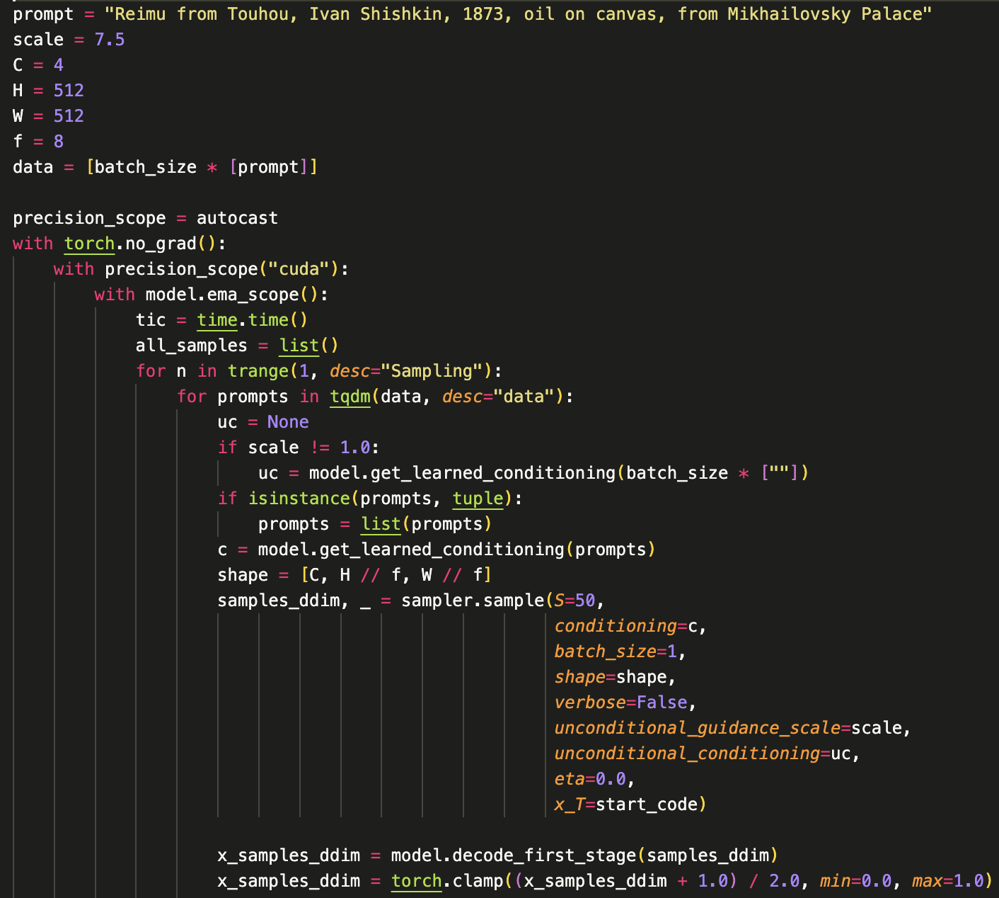

# Stable Diffusion - How does it work?

There's some prettier articles maybe worth taking a look at, but I think they miss/gloss over some details and don't build up to SD in a useful way, so this is yet another explanation.
https://www.paepper.com/blog/posts/how-and-why-stable-diffusion-works-for-text-to-image-generation/
https://huggingface.co/blog/stable_diffusion
https://huggingface.co/blog/annotated-diffusion

## The Unconditional U-Net

The U-Net is at the core of diffusion models, and let's first talk about an unconditional diffusion U-Net.

An unconditional diffusion U-Net takes in a noisy 64x64 image, and returns a slightly less noisy 64x64 image. (Sidenote: This was trained on 64x64 -> 64x64 and hence performs best there, but can actually do any MxN -> MxN - as long as it fits in memory)

Training an unconditional diffusion U-Net is fairly straightforward - add noise to images gradually (original, noisy, noisier, noisiest..), and train it to undo one step (noisiest -> noisier), (noisier -> noisy), (noisy -> original).

At the end of the day, using your unconditional U-Net, you can start with a random 64x64 noise image, and over some number of steps (~30-50) gradually make it clearer and clearer until you end up with an image that looks like it comes from your dataset!

### Class conditioning

So, an unconditioned U-Net isn't super impressive - it just gives you an image that looks like it came from the dataset, but you'd like to have more control over what you generate. When class-condtioning, addition to taking in the 64x64 input, you give the U-Net another class label, which defines what kind of image it should be making. (This could be a one-hot encoded vector of some small number of categories)

Class-conditioning is the easiest form of this, your images are split up into K classes, and instead of asking it to perform (noisy) -> (less noisy), you ask it to perform (noisy, class) {64x64, K} -> (less noisy) {64x64}.

At the end of the training process, you should end up with a model that has a denoising process conditioned on a specific class, and hence when you start with random noise, and a specific class, the image will generally come out of that class!

## The Text Conditioned U-Net

Text conditioning is the next step, but this is a little harder - as you have to answer the question: "What kind of format works best for providing text as a conditioner?"

The answer is that you should use some sort of attention in the U-Net (to determine how to use the text etc), and that the text should be inputted as some sort of useful embedding. Let's see how we get there.

### Tokenizing

This is a relatively straightforward process - you split up the text into manageable tokens, generally about ~5 characters long. This splits on natural word boundaries + some special characters. I don't entirely understand what its rules are.

Noteworthy: the token limit of Stable Diffusion is 77 - it expects a constant size here.

### Embedding

After you get the 77 tokens, you use a pre-trained CLIP model to embed them, this takes you from 77 tokens to a 77x768 tensor.

And that's your conditioning input to the U-Net! You use a 64x64 noisy image + a 77x768 text-embedding tensor. Since you train your model with a text-embedding tensor, so the model has picked up on the ideas of what the right denoising feels like for a kind of text embedding.

Your U-Net is now {64x64, 77x768} -> {64x64}

### Sidetrack: Other Text Representations

This 77x768 representation isn't the only approach, and it's worth briefly thinking about others.

CLIP (and other text models) are very capable of embedding larger things than just tokens - you could very well envision a world where you fed the entire input into CLIP, and conditioned on a single 1x768 text input.

And that's exactly what Justin Pinkney has tried out here: https://twitter.com/Buntworthy/status/1566744186153484288, ie: training stable diffusion to take a CLIP embedding instead. This allows you to use images as input too - as CLIP can be used to generate an embedding from an image.

The tradeoff seems to be roughly on deciding whether your U-Net does more of the work (you give it per-word CLIP embeddings), or if you let CLIP do more of the work (CLIP decides how to combine everything into a single embedding).

For more comparison, it's worth noting that:

- Dalle2 seems to use a single CLIP embedding as input
- Imagen uses per-token text embeddings via the T5-xxl model (a larger model than CLIP)

### Sidetrack: Text Conditioning ("Classifier-free Guidance") vs Guidance ("Classifier Guidance")

All these aforementioned techniques use conditioning, but there's a different technique called classifier guidance, which is what CLIP-Guided diffusion (Disco Diffusion, Majesty Diffusion, etc) used.

While conditioning happens during train-time, and hence you can't really change the form of the it post-hoc (ie: you can't change the CLIP model to T5 or a newer CLIP model, you can't swap out a CLIP conditioning for another conditioning super easily), guidance happens during run-time.

How does guidance work during run-time? I... don't really get it!
But, during runtime you can add some additional loss function, and this will additionally guide your image. It's used by many different models in different ways

- CLIP Guided Diffusion etc: Sample a patch of the image, compare it to the target CLIP embedding, and generate a loss
- Aesthetic guided diffusion: Using an extrinsic aesthetic model, get a loss of the current image, and use it to push things in the right direction

Notably: Guided methods are somewhat slower usually, and take more steps, but the ability to use arbitrary-ish loss functions is great! MidJourney is considered to use some custom aesthetic model to get a lot of their quality.

## After the U-Net: Decoding

A 64x64 image is quite small, so there's a final decoder layer that handles upscaling this by a factor of 8, to a 512x512 image.

Now, let's take a look at the code to see that we can identify all the pieces we just talked about:

- Parameters:

  - `scale`: 7.5 - I've not mentioned this before but it's fairly straightforward, it controls how strongly the conditioning is applied
  - `C`: 4 - Channels in the image, always 4.
  - `H`, `W`: Height and width
  - `f`: 8, Upscaling factor (ie: 64x64 -> 512x512)

- Steps:
  - `model.get_learned_conditioning(prompts)`: Get the 77x768 text conditioning vector once.
  - `sampler.sample(S=50...)`: Run the diffusion model for 50 steps, using the provided conditioning
  - `model.decode_first_stage(samples_ddim)`: Decode the result from a 64x64 to a 512x512 output.

## Going further with Stable Diffusion

### Seeds

The seed controls the initial random noise pattern, but everything else is deterministic.

What this means in practice, is that if you change other parameters, including the scale or the prompt slightly, the diffusion model generally produces rather similar results.

### Img2Img

Image to image modes generally work by setting the random initial noise to instead start with a noisy version of some initial image.

This is: image pixels where k% of them are noise instead, which roughly translates to kinda following the overall structure of the image.

### Conditioning interpolation

An interesting trick is to generate videos moving between one or more different prompts.

You do this as follows:

- Run the aformentioned code for multiple prompts upto the step where you run `model.get_learned_conditioning(prompts)`
- `lerp` (linear interpolate) or maybe more reasonably `slerp` (spherical linear interpolate) between the prompts
- Run the code after for each of the interpolation points

In theory this is a little weird - as the 77x768 CLIP embeddings are corresponding to individual tokens, you're interpolating individual tokens, which is strange.

However, in practice this works rather well, as you get an image cleanly moving between two points.
